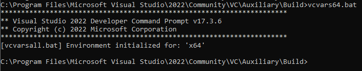

# Optimization of Convolutional Neural Networks 
## Installation of NVIDIA Drivers, CUDA, cuDNN, Anaconda Python 
1. Install [Microsoft Visual Studio Community Edition](https://visualstudio.microsoft.com/vs/community/) with all C++ options. 
2. Relevant information about Nvidia Graphics card's compute capability can be found here. [CUDA Compute Capability](https://en.wikipedia.org/wiki/CUDA)   
For Example: Nvidia Geforce GTX 1050 Ti: 
    *  Micro-architecture: Pascal 
    *  Compute capability: 6.1  [Driver Search](https://www.nvidia.com/download/find.aspx)
    *  CUDA SDK 11.x supports Pascal architecture 
    *  For cuDNN, download a version that supports CUDA SDK 11.x 
3. Run `C:\Program Files\Microsoft Visual Studio\2022\Community\VC\Auxiliary\Build>vcvars64.bat` in Program Files as shown in Figure 1 below: 

4. Install CUDA with supported compute capability as described above: [CUDA Installation](https://developer.nvidia.com/cuda-downloads)
5. Install [cuDNN](https://developer.nvidia.com/cudnn) and move the files into a new-folder called tools in Nvidia GPU Computing Toolkit 
6. Ensure the following paths are available in Environment Varibales:  
C:\Program Files\NVIDIA GPU Computing Toolkit\CUDA\v11.8\bin   
C:\Program Files\NVIDIA GPU Computing Toolkit\CUDA\v11.8\libnvvp   
C:\Program Files\NVIDIA GPU Computing Toolkit\CUDA\v11.8\extras\CUPTI\lib64   
C:\Program Files\NVIDIA GPU Computing Toolkit\CUDA\v11.8\include   
C:\Program Files\NVIDIA GPU Computing Toolkit\tools\cudnn-windows-x86_64-8.6.0.163_cuda11-archive\bin   
C:\Program Files\NVIDIA GPU Computing Toolkit\tools\cudnn-windows-x86_64-8.6.0.163_cuda11-archive\include   
7. Install [Anaconda Python](https://www.anaconda.com/)
8. Check in Command Prompt and Windows Powershell in  `python --version` and `conda` 
9. In Command Prompt: 
    * `conda create -n <your_env-name> python=3.9.13` 
    * To activate your environment, type `conda activate <your_env-name>' and to deactivate an active environment, type `conda deactivate'
    * `pip install numpy        `
    * `pip install pandas       `
    * `pip install matplotlib   `
    * `pip install requests     `
    * `pip install scipy        `
    * `pip install scikit-learn `
    * `pip install seaborn      `
    * `pip install tensorflow   `
    * `conda install pytorch cudatoolkit -c pytorch   ` for both CPU and GPU 
    * `conda install pytorch -c pytorch   ` for only CPU  
    * `pip install torchvision   ` 
10. ```{python}
        # Test for Tensorflow and Pytorch for CUDA GPUs, should return True
        import tensorflow as tf
        import torch
        print(tf.__version__)
        print(len(tf.config.list_physical_devices('GPU'))>0)         
        print("GPU available: {}".format(torch.cuda.is_available()))
    ```
